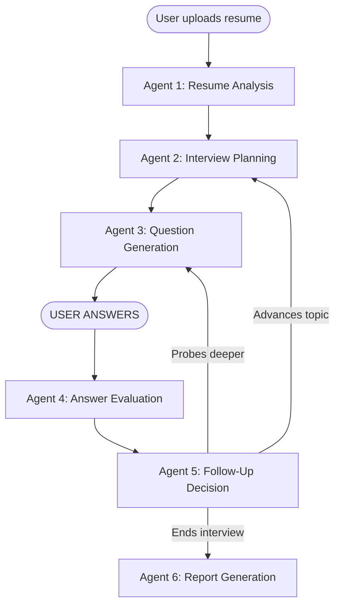

# 🤖 AI Interview Simulator

> An advanced, multi-agent AI interview system with adaptive follow-ups, real-time voice analysis, and deep performance analytics. 

**[🔗 Try the Live Demo here!](https://ai-interview-simulator-three-roan.vercel.app/)**

---

## 💡 What is this?

This is a full-stack application that simulates a technical interview using AI. Instead of just asking a static list of questions, the system dynamically adapts to your answers. 

Under the hood, we use **6 distinct LangGraph agents** running on a blazing-fast **FastAPI** backend (powered by the Groq API) to evaluate your resume, plan topics, generate questions, grade your answers across 5 dimensions, and even detect if you contradict yourself during the interview.

The frontend is a lightweight, beautifully designed vanilla JS app hosted on Vercel.

---

## 🚀 Quick Setup (Local Development)

Want to run this yourself? Here is how to get it going locally.

### Step 1 — Clone & Install
First, grab the code and install the backend dependencies. We've optimized the requirements so it runs lightning fast!

```bash
git clone https://github.com/Krishna-3144/AI-Interview-Simulator.git
cd AI-Interview-Simulator
pip install -r requirements.txt
```

### Step 2 — Configure Environment
Copy the example environment file:
```bash
cp .env.example .env
```
Open `.env` and add your **Groq API key**:
```ini
GROQ_API_KEY=your_groq_api_key_here
```
*(Get a free key at: https://console.groq.com)*

### Step 3 — Run the Backend
Start the FastAPI server:
```bash
uvicorn backend.api.main:app --host 127.0.0.1 --port 8000
```

### Step 4 — Run the Frontend
In a new terminal window, serve the frontend folder:
```bash
cd frontend
python -m http.server 3000
```
Open your browser to **http://localhost:3000** and start your interview!

---

## 🧠 The Agent Architecture

The backend isn't just one big LLM call. It uses a graph of specialized agents:



---

## 🎙️ Voice Mode & Groq Cloud

Originally, this project used local PyTorch and Whisper models. To make it incredibly fast and deployable on free-tier hosting (like Render), we migrated all heavy ML operations to the **Groq API Cloud**. 

- **Speech-to-Text**: We use Groq's `whisper-large-v3` endpoint for near-instant transcription.
- **LLM Engine**: Core logic runs on Groq's high-speed inference engine, meaning the agents can talk to each other and generate responses in milliseconds.

---

## 📊 How You're Scored

Every single answer you give is graded across 5 distinct dimensions:

| Dimension | Weight | What it measures |
|---|---|---|
| **Technical Accuracy** | 35% | Correctness, concept understanding |
| **Depth** | 25% | Examples, edge cases, tradeoffs |
| **Communication** | 20% | Clarity, structure, coherence |
| **Confidence** | 10% | Audio analysis + text inference |
| **Consistency** | 10% | Ensuring no contradictions with prior answers |

*If your score drops below 65% on a question, the AI will dynamically generate a follow-up question to probe your weaknesses!*

---

## 🛠️ Tech Stack

- **Frontend**: HTML5, Vanilla JavaScript, CSS Variables (Dark/Light Dual-Tone Theme)
- **Backend**: Python, FastAPI, Uvicorn
- **AI/Agents**: LangGraph, LangChain, Groq API
- **Deployment**: Vercel (Frontend), Render (Backend)

---

*Built with ❤️ for developers looking to ace their next interview.*
